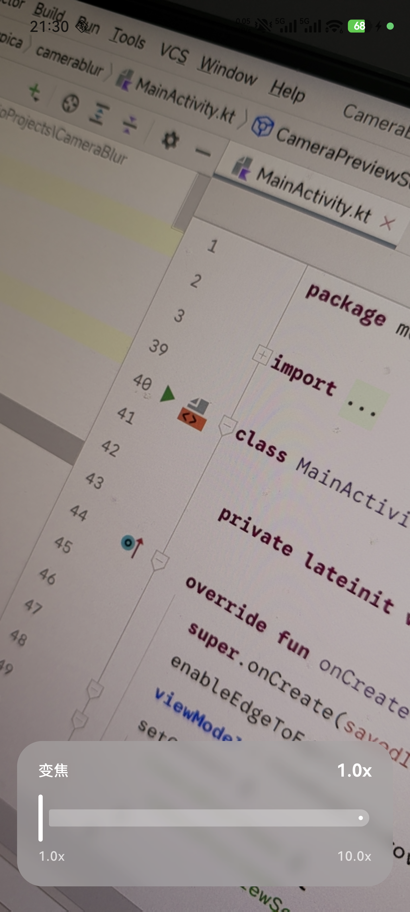

# CameraBlur

一个 Android 相机实时模糊背景组件的 Demo 项目，实现类似 iOS 毛玻璃效果的相机控制条背景。

## 预览效果

<p align="center">
  
</p>

## 功能特性

- 📷 **实时相机预览** - 基于 CameraX + Jetpack Compose
- 🔍 **变焦控制** - 底部滑动条控制相机缩放
- 🌫️ **实时高斯模糊** - 使用 ImageAnalysis 在后台线程处理相机帧
- 🎨 **iOS 风格效果** - 饱和度增强 + 亮度提升 + 浅色混色叠加
- 📱 **精确位置匹配** - 模糊背景与相机预览画面完美对齐

## 技术栈

| 技术 | 版本 |
|------|------|
| Kotlin | 2.0.21 |
| Jetpack Compose | BOM 2024.09.00 |
| CameraX | 1.5.0-alpha06 |
| Material3 | Latest |
| Accompanist Permissions | 0.37.2 |

## 项目结构

```
app/src/main/java/me/spica/camerablur/
├── MainActivity.kt              # 入口 Activity + Compose UI
├── CameraPreviewViewModel.kt    # 相机状态管理 + ViewModel
├── blur/
│   ├── BlurProcessor.kt         # 高斯模糊处理器 (StackBlur 算法)
│   └── BlurredFrameAnalyzer.kt  # 相机帧分析器 (ImageAnalysis)
└── ui/
    ├── ZoomControlBar.kt        # 变焦控制条组件
    └── theme/                   # Material3 主题
```

## 核心实现

### 1. 相机帧捕获

使用 CameraX 的 `ImageAnalysis` UseCase 在独立线程中捕获相机帧：

```kotlin
val imageAnalysisUseCase = ImageAnalysis.Builder()
    .setBackpressureStrategy(ImageAnalysis.STRATEGY_KEEP_ONLY_LATEST)
    .setOutputImageFormat(ImageAnalysis.OUTPUT_IMAGE_FORMAT_YUV_420_888)
    .build()
```

### 2. 高斯模糊算法

采用 StackBlur 算法，兼容所有 Android 版本：

```kotlin
BlurProcessor.blur(
    source = bitmap,
    radius = 35f,        // 模糊半径
    scale = 0.25f,       // 缩放处理提高性能
    saturation = 1.0f,   // 饱和度
    brightness = 65f,    // 亮度提升
    tintColor = 0xFFFFFF,// 浅色混色
    tintAlpha = 30       // 混色透明度
)
```

### 3. 位置精确匹配

通过 `onGloballyPositioned` 获取控制条实际位置，动态计算裁切区域：

```kotlin
Modifier.onGloballyPositioned { coordinates ->
    val top = coordinates.positionInParent().y.toInt()
    val height = coordinates.size.height
    viewModel.updateControlBarPosition(viewWidth, viewHeight, top, height)
}
```

## 快速开始

### 环境要求

- Android Studio Ladybug 或更高版本
- JDK 11+
- Android SDK 24+ (minSdk)

### 构建运行

```bash
# 克隆项目
git clone https://github.com/user/CameraBlur.git

# 构建 Debug APK
./gradlew assembleDebug

# 安装到设备
./gradlew installDebug
```

### 权限

应用需要相机权限：

```xml
<uses-permission android:name="android.permission.CAMERA" />
<uses-feature android:name="android.hardware.camera" android:required="true" />
```

## 自定义配置

### 调整模糊效果

在 `BlurredFrameAnalyzer.kt` 中修改参数：

```kotlin
var blurRadius: Float = 35f   // 模糊半径 (越大越模糊)
var blurScale: Float = 0.25f  // 处理缩放 (越小越快)
```

### 调整颜色效果

在 `BlurProcessor.kt` 的 `blur()` 方法中：

```kotlin
saturation = 1.2f     // 饱和度 (>1 更鲜艳)
brightness = 50f      // 亮度偏移
tintColor = 0xE0E8FF  // 淡蓝色混色
tintAlpha = 40        // 混色透明度
```

## License

```
MIT License

Copyright (c) 2024

Permission is hereby granted, free of charge, to any person obtaining a copy
of this software and associated documentation files (the "Software"), to deal
in the Software without restriction, including without limitation the rights
to use, copy, modify, merge, publish, distribute, sublicense, and/or sell
copies of the Software, and to permit persons to whom the Software is
furnished to do so, subject to the following conditions:

The above copyright notice and this permission notice shall be included in all
copies or substantial portions of the Software.
```
